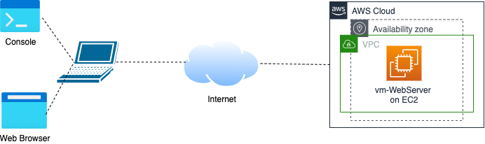
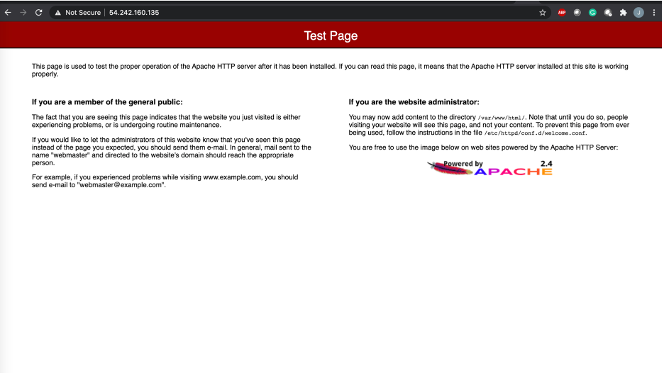
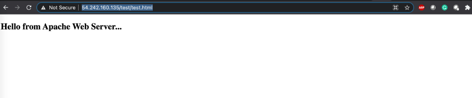
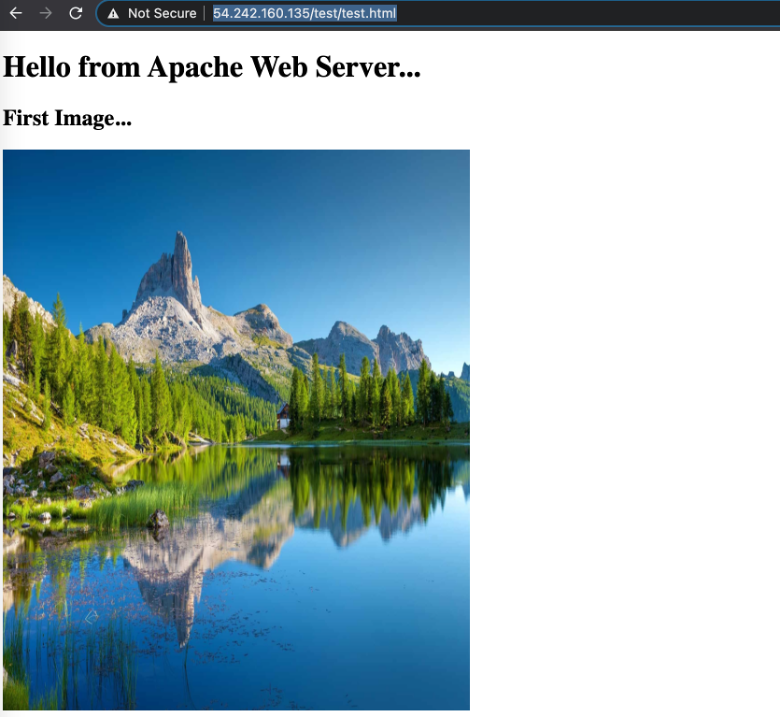
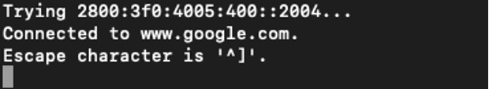
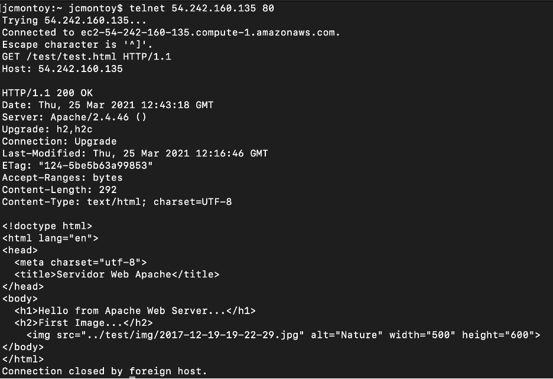
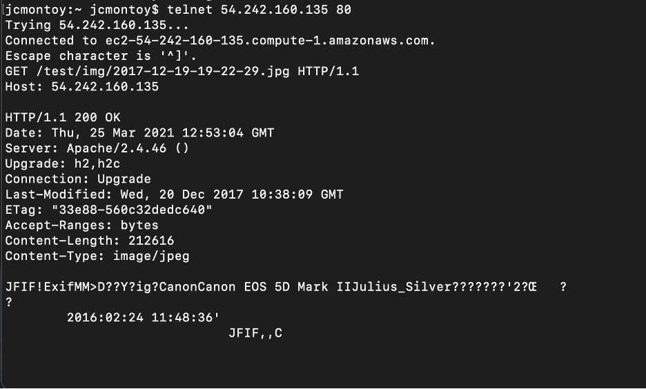
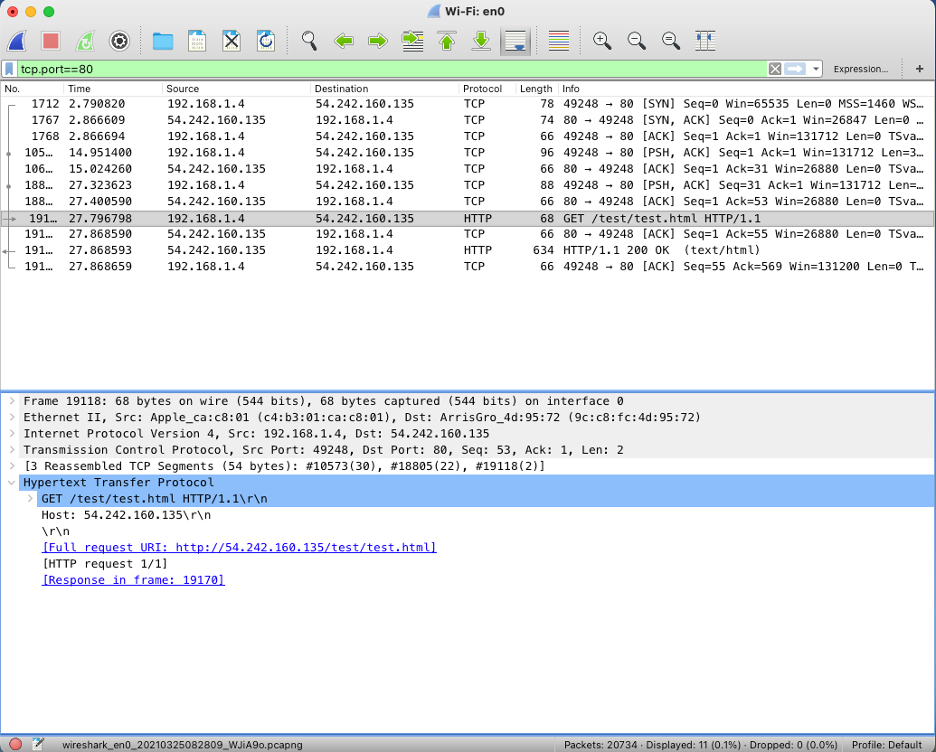

# **Laboratorio N3**

**Curso:** Telemática <br>
**Título:** Redes Manualmente.Servicio Web.<br>
**Objetivo:** Desarrollar habilidades en los aspectos relacionados con el servicio web, especificamente los relacionados con el protocolo http.<br>
**Duración:** 35 mins.<br>

*******

**Tabla de Contenido**

1. [Introducción](#introduction)
2. [Recursos](#resources)
3. [Desarrollo](#development) <br>

*******

<div id='introduction'/> 

### **1. Introducción**

En este laboratorio vamos a desarrollar algunas tareas en relación con servicios básicos de Internet como lo es el servicio web. Especificamente, la actividad se va a concentrar en el despligue de una aplicación web estática.

Como se puede observar en la figura 1, se requiere implementar una máquina que funcione como un servidor web. Para esto vamos a crear una instancia de EC2 en AWS y sobre este instalaremos un servidor web (p.ej., apache) sobre el cual desplegaremos una página web escrita en html.

En la estación cliente, se requerirá una terminal de consola así como un browser. Del lado del servidor, linux, específicamente ubuntu.



*******

<div id='resources'/> 

### **2. Recursos**

Vamos a empezar a trabajar los aspectos de servicios y aplicaciones de Internet. En este sentido se van a realizar las siguientes tareas de forma manual. Igualment , se requier de Una máquina con cualquier sistema operativo (preferiblemente Linux)y una conexión a Internet. A continuación se listan el conjunto de recursos a utilizar:

* EC2.
* Linux - Ubuntu 20.04.
* Apache.


*******

<div id='development'/>  

### **3. Desarrollo**

A continuación se describen el conjunto de pasos que se requieren para el desarrollo de la actividad.

<div id='instance'/> 

#### **3.1. Instancia de una máquina virtual EC2:**

En esta sección crearemos una instancia EC2 la cual actuará como Web Server. Recuerde que esta VM estará asociada a la subred privada 1 de la VPC. Diríjase al “home” de la consola de administración de AWS. Escoja el servicio de EC2. En el panel izquierdo seleccione la opción de “Instances” seleccione la opción “launch instances” y ejecute lo siguientes pasos:

* **Name and Tags:**
    * Name: vm-WebServer-1.
* **Application and OS Images (Amazon machine image)**
    * Escoja la imagen de Amazon Machine Image (AMI) la cual contiene la imagen del sistema operativo. Seleccione Ubuntu server 20.04 LTS (HVM), SSD Volume Type. Free Tier.
* **Instance type:** Seleccione el tipo de instancia t2.micro (columna type) 
* **Key pair (login):** Seleccione una llave existente o en su defecto cree una nueva.
* **Network Settings:** Ahora configure, los siguientes parámetros (click en edit):
    * **Network:** Seleccione la VPC que esta por defecto.
    * **Subnet:** No preference (Default subnet in any availability zone)
    * **Auto-assign Public IP:** Enable
    * **Firewall (security groups):**
        * Seleccione la opción de “create security group” 
        * Active las casillas para el tráfico SSH y HTTP.Permita que reciban peticiones de cualquier dirección. 
        * **Nota:** Para el caso de ssh, recuerde que posteriormente puede modificar el security group para permitir solo conexiones desde la dirección IP que usted indique.
* **Configure storage:** 1 x 8 Gib gp2 root volume 

Al final puede ver lo siguiente en la vista de summary.

Ahora vamos a proceder a conectarnos a la máquina creada de la siguiente forma:

* En una terminal de consola desde su máquina, inicie una sesión ssh contra el servidor que configuro. Recuerde, que en caso de ser necesario, antes, debe cambiar los permisos del archivo .pem que creo. Para esto aplique el comando: 

```sh
ubuntu@dirIP $ chmod 400 ST0255.pem
```

#### **3.2. Instalación de Servidor Web:**

En esta sección vamos a proceder a instalar un servidor web. En la actualidad se puede decir que existen dos servidores web muy bien posicionados: apache (https://httpd.apache.org/) y NGINX (https://www.nginx.com/). Para efectos de este laboratorio, vamos a proceder a instalar apache sobre el sistema operativo de la máquina que instanciamos en la sección anterior. En primer lugar, actualicemos la lista de paquetes:

```sh
sudo apt-get update
```
Ahora, se procede a instalar el servidor web apache, para esto digite el siguiente comando:

```sh
sudo apt-get install apache2
```
Ahora se hace necesario iniciar el servicio de apache en la máquina. Para esto vamos a utilizar el siguiente comando:

```sh
sudo systemctl start apache2
```

Para verificar la conexión al servidor web apache que hemos instalado, abra una nueva ventana de un navegador (browser) y digite la dirección IP Pública de la siguiente forma:



Si logra ver la página de bienvenida del servidor web apache. Ya ha instalado su servidor Web!!!

### **3.3 Desplegando una Página Web**

Ahora se procede a crear una simple página web para verificar el funcionamiento del protocolo http. Para esto vamos a crear un directorio en la ruta (path) donde Apache almacena los objetos web. En el caso de esta distribución de Linux esta ruta esta en el directorio /var/www/html. Para esto vamos a crear un directorio denominado test y este vamos a crear archivo test.html

```sh
cd /var/www/html
sudo mkdir test
cd test
sudo nano test.html
```
Digite lo siguiente:

```html
<!doctype html>
<html lang="en">
    <head>
        <meta charset="utf-8">
        <title>Servidor Web Apache</title>
    </head>
    <body>
        <h2>Hello from Apache Web Server...</h2>
    </body>
</html>
```

Ahora, desde el navegador agregue la siguiente url: http://MidirecciónIP/test/test.html, donde MiDirecciónIP es la dirección IP pública que tiene su máquina (instancia EC2).



Ahora, se requiere modificar nuestra página web y vamos a agregar una imagen. Para esto, descargue una imagen disponible con el comando wget. Ubique esta imagen en un directorio img bajo /var/www/html/test/.

```sh
sudo mkdir img
cd img
sudo wget https://pixnio.com/free-images/2017/12/19/2017-12-19-19-22-29.jpg
```
Ahora, modifique su página html:

```html
<!doctype html>
<html lang="en">
    <head>
        <meta charset="utf-8">
        <title>Servidor Web Apache</title>
    </head>
    <body>
        <h2>Hello from Apache Web Server...</h2>
        <h2>First Image...</h2>
        
    </body>
</html>
```
Ahora, desde el navegador agregue la siguiente url: http://MidirecciónIP/test/test.html, donde MiDirecciónIP es la dirección IP pública que tiene su máquina (instancia EC2).



### **3.4 Peticiones Web.**

1.	En un browser, visite la página www.google.com y observe el resultado.
2.	Ahora vamos a realizar el mismo proceso que el browser realiza desde la terminal de consola, para esto ejecute el comando: 
    
    ```sh
    telnet www.google.com http
    ```
    Este comando permitirá abrir una conexión a una máquina servidor (denominado www.google.com), la cual corre un servicio web. La comunicación entre la máquina cliente y servidor se realiza utilizando el protocolo http. El resultado en la consola será el siguiente:

    

    Ahora se requiere que usted obtenga un recurso alojado en ese servidor web. Para esto, se hace necesario formar una petición http. Digite lo siguiente: 

    ```sh
    GET / HTTP/1.1 (presione enter)
    Host: www.google.com (presione enter)
    Connection: close (presione enter)
    ```
    Presione enter una vez mas. Esto envía una línea en blanco al servidor finalizando así la petición http. Analice lo visualizado en la consola.

3. Este mismo proceso vamos a realizarlo con el servidor web que hemos configurado. Ejecute los pasos que se dan a continuación:

    

4.	Ahora realice el proceso para el recurso que esta embebido en la página (la imagen)

    

5.	Analizar la interacción del protocolo http con Wireshark.

    Para esta sección del laboratorio se requiere la instalación de un analizador de protocolos. Para efectos de este curso, utilizaremos Wireshark (https://www.wireshark.org/), el cual puede ser considerado el analizador de protocolos mas utilizados en este momento. Por favor descargue la herramienta e instálela en su equipo.

    Una vez la instale, inicie la herramienta, seleccione el adaptador de red por el cual desea hacer la captura. Para efectos de este caso, vamos a seleccionar el adaptador inalámbrico. Una vez seleccionado, podemos empezar el proceso de captura de táfico, esto quiere decir que todo el tráfico que circule por ese adaptador de red será capturado para poder ser analizado. Incie el proceso de captura de tráfico para el adaptador en wireshark.

    Por favor, ejecute el paso 3 y 4. Detenga la captura y vamos a proceder a realizar el análisis. Para esto aplique vamos a aplicar un filtro por protocolo y puerto “tcp.port==80” y observaremos que la herramienta nos muestra los mensajes que fueron intercambiados.  Seleccione el paquete que corresponde a la solicitud realizada y realice un análisis de la misma.

    **Nota:** Tenga en cuenta que puede realizar el filtro también por protocolo http.

    

*******

