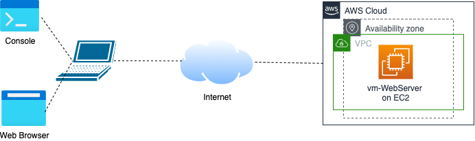

# **Laboratorio N4**

**Curso:** Telemática <br>
**Título:** Redes Manualmente.Servicio Web.<br>
**Objetivo:** Desarrollar habilidades en los aspectos relacionados con el servicio web, especificamente los relacionados con el protocolo http.<br>
**Duración:** 35 mins.<br>

*******
**Tabla de Contenido**

1. [Introducción](#introduction)
2. [Recursos](#resources)
2. [Desarrollo](#development)

*******

<div id='introduction'/> 

### **1. Introducción**

En este laboratorio vamos a desarrollar algunas tareas en relación con servicios básicos de Internet como lo es el servicio web. Especificamente, la actividad se va a concentrar en el despligue de una aplicación web estática.

Como se puede observar en la figura 1, se requiere implementar una máquina que funcione como un servidor web. Para esto vamos a crear una instancia de EC2 en AWS y sobre este instalaremos nuestra aplicación web. 

En la estación cliente, se requerirá una terminal de consola así como un browser. Del lado del servidor, linux, específicamente ubuntu así como node.js.



*******

<div id='resources'/> 

### **2. Recursos**

Vamos a empezar a trabajar los aspectos de servicios y aplicaciones de Internet. En este sentido se van a realizar las siguientes tareas de forma manual. Igualment , se requier de Una máquina con cualquier sistema operativo (preferiblemente Linux)y una conexión a Internet. A continuación se listan el conjunto de recursos a utilizar:

* EC2.
* Linux - Ubuntu 20.04.
* Node.js - Express.


*******

<div id='development'/>  

### **3. Desarrollo**

A continuación se describen el conjunto de pasos que se requieren para el desarrollo de la actividad.

#### **3.1. Instancia de una máquina virtual EC2:**

En esta sección crearemos una instancia EC2 la cual actuará como Web Server. Recuerde que esta VM estará asociada a la subred privada 1 de la VPC. Diríjase al “home” de la consola de administración de AWS. Escoja el servicio de EC2. En el panel izquierdo seleccione la opción de “Instances” seleccione la opción “launch instances” y ejecute lo siguientes pasos:

* **Name and Tags:**
    * Name: vm-WebServer.
* **Application and OS Images (Amazon machine image)**
    * Escoja la imagen de Amazon Machine Image (AMI) la cual contiene la imagen del sistema operativo. Seleccione Ubuntu server 20.04 LTS (HVM), SSD Volume Type. Free Tier.
* **Instance type:** Seleccione el tipo de instancia t2.micro (columna type) 
* **Key pair (login):** Seleccione una llave existente o en su defecto cree una nueva.
* **Network Settings:** Ahora configure, los siguientes parámetros (click en edit):
    * **Network:** Seleccione la VPC que esta por defecto.
    * **Subnet:** No preference (Default subnet in any availability zone)
    * **Auto-assign Public IP:** Enable
    * **Firewall (security groups):**
        * Seleccione la opción de “create security group” 
        * Active las casillas para el tráfico SSH y HTTP.Permita que reciban peticiones de cualquier dirección. 
        * **Nota:** Para el caso de ssh, recuerde que posteriormente puede modificar el security group para permitir solo conexiones desde la dirección IP que usted indique.
* **Configure storage:** 1 x 8 Gib gp2 root volume 

Al final puede ver lo siguiente en la vista de summary.

Ahora vamos a proceder a conectarnos a la máquina creada de la siguiente forma:

* En una terminal de consola desde su máquina, inicie una sesión ssh contra el servidor que configuro. Recuerde, que en caso de ser necesario, antes, debe cambiar los permisos del archivo .pem que creo. Para esto aplique el comando: 

```sh
ubuntu@dirIP $ chmod 400 ST0255.pem
```

#### **3.2. Instalación de Node.js:**

La aplicación está escrita utilizando un entorno de ejecución de javascript como lo es node.js. A continuación se describe el proceso de instalación de node.js v16.x para una máquina con sistema operatino ubuntu 20.04.

**Node.js v16.x**:

```sh
# Using Ubuntu
curl -fsSL https://deb.nodesource.com/setup_16.x | sudo -E bash -
sudo apt-get install -y nodejs
```
Ahora, verificamos que la instalación de node este correctamente realizada, para esto digite el siguiente comando:

```sh
ubuntu@dirIP $ node -v
```
#### **3.3. Clonar repositorio o Actualizar el repo**

A continuación, procedar a clonar el repositorio que contiene el código fuente de la aplicación web en la máquina vm-WebServer que creo en la sección 3.1 de este documento. Para esto aplique el comando:

```git
git clone https://github.com/ST0255/st0255-20231.git
```
o 

```git
git pull origin main
```


#### **3.4. Ejecutar la Aplicación Web**

Ubiquese en el directorio api de la carpeta WebApp. Desde ahi, por favor ejeute la aplicación web a través del siguiente comando:

```sh
sudo node index.js
```
#### **3.5. Actividades**

Desde un browser, cargue la página. Para esto digite la siguiente URL: http://<dirIP:port>. Observe por favor que la dirección IP es la pública de su instacia EC2 y el código de la aplicación esta corriendo en el puerto 8080. 

Igualmente, haga el ejercicio de solicitar desde una terminal de consola las diferentes peticiones http para solicitar los recursos de este servicio. Finalmente, realice el ejercicio de capturar las peticiones http usando la herramienta wireshark.

*******